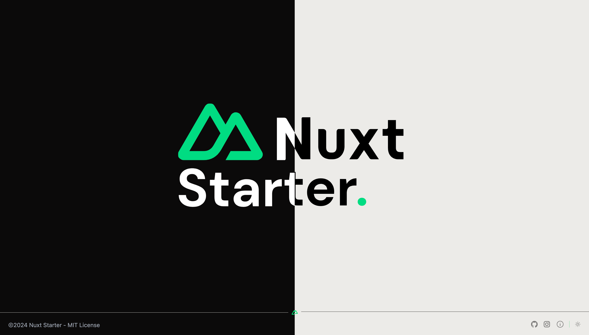

It's a minimal starter for Nuxt 3 and start building your next web application simply and quickly. Including :
- [Tailwind CSS](https://tailwindcss.com/)
- Color mode (dark & light)


## Quick Setup

--- 

To get started, follow these steps:


```bash
# npm
npm install

# pnpm
pnpm install

# yarn
yarn install

# bun
bun install
```

## Development Server

---

Start the development server on `http://localhost:3000`:

```bash
# npm
npm run dev

# pnpm
pnpm run dev

# yarn
yarn dev

# bun
bun run dev
```

## Production

---

Build the application for production:

```bash
# npm
npm run build

# pnpm
pnpm run build

# yarn
yarn build

# bun
bun run build
```

Locally preview production build:

```bash
# npm
npm run preview

# pnpm
pnpm run preview

# yarn
yarn preview

# bun
bun run preview
```

## Author

---

- [Johann Cavallucci]('https://github.com/cavalluccijohann')

